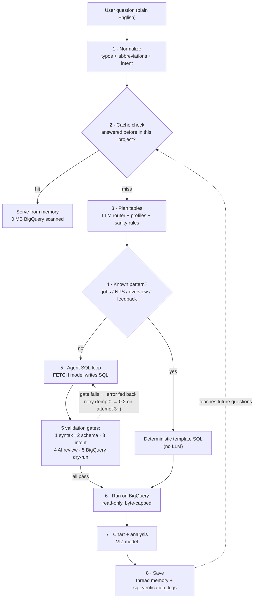

# NexA

**NexA** is an internal analytics workspace inspired by [Hex](https://hex.tech): ask BigQuery questions in plain English, build **notebook logic** with chained SQL, pin results to a **dashboard**, and let the AI **learn from your project** — Thread answers and Notebook cells teach the next question.

Stack: **FastAPI** + **React** + **SQLite/Postgres** + **BigQuery** + multi-provider LLMs (**Google GenAI / OpenAI / Anthropic** native SDKs — switch via `.env`).

---

## Table of contents

1. [What NexA does](#1-what-nexa-does)
2. [Recommended workflow](#2-recommended-workflow)
3. [How the platform works](#3-how-the-platform-works)
4. [Pages and features](#4-pages-and-features)
5. [Ask pipeline (Thread)](#5-ask-pipeline-thread)
6. [Notebook (Hex-style logic)](#6-notebook-hex-style-logic)
7. [Project memory and cache](#7-project-memory-and-cache)
8. [SQL validation (schema safety)](#8-sql-validation-schema-safety)
9. [Repository layout](#9-repository-layout)
10. [Run locally](#10-run-locally)
11. [Environment variables](#11-environment-variables)
12. [Deploy to Render](#12-deploy-to-render)
13. [Key files reference](#13-key-files-reference)
14. [Limitations and roadmap](#14-limitations-and-roadmap)

---

## 1. What NexA does

| Capability | Description |
|------------|-------------|
| **Projects** | Isolated workspaces — tables, memory, notebook, dashboard |
| **Thread** | Chat Q&A: natural language → SQL → BigQuery → chart + analysis |
| **Notebook** | Input + SQL + text cells, `{{ variables }}`, chained `FROM prior_cell`, logic DAG |
| **Data browser** | Warehouse catalog, endorse tables, column hints, YAML model import |
| **Dashboard** | Pin Thread answers as KPIs/charts; share via link |
| **Project memory** | Thread + Notebook SQL saved per project — fed into every new question |
| **Result cache** | Reuse prior rows — **0 MB BigQuery scan** when possible |

```
┌─────────────┐     ┌──────────────┐     ┌─────────────┐
│   React UI  │────▶│  FastAPI API │────▶│  BigQuery   │
│ Thread/     │     │ ask_pipeline │     │  (your data)│
│ Notebook/   │     │ notebook_    │     └─────────────┘
│ Dashboard   │     │ engine       │            │
└─────────────┘     └──────┬───────┘            │
                           │                    ▼
                           ▼              ┌─────────────┐
                    ┌─────────────┐       │ OpenRouter /│
                    │ SQLite /    │       │ Vertex AI   │
                    │ Postgres    │       └─────────────┘
                    │ memory,     │
                    │ notebook    │
                    └─────────────┘
```

---

## 2. Recommended workflow

NexA is designed so **the project evolves** — not a pile of hardcoded rules.

```
1. Create project
2. Data tab      → add tables, endorse key tables, column descriptions / YAML import
3. Notebook tab  → enable if prompted, run starter cells (defines how you query NPS, dates, etc.)
4. Thread tab    → ask in plain English; AI reuses Notebook + prior Thread SQL
5. Settings      → "Reuse prior query results" on (default) to save BigQuery credits
```

### Thread vs Notebook

| | **Thread** | **Notebook** |
|---|-----------|--------------|
| **Use for** | Quick questions, exploration, follow-ups | Repeatable logic, filters, multi-step SQL |
| **Output** | One answer + chart + analysis | Cached cell runs + logic graph |
| **Teaches AI** | Every answer saved to memory | Every cell run fed into Thread context |
| **Best when** | "How many NPS in June?" | "Monthly NPS trend with date range input" |

**Thread** is the default path for everyone. **Notebook** is optional but powerful — run cells once, then Thread mirrors those patterns.

---

## 3. How the platform works

### Layer 1 — Data

- **BigQuery** via GCP service account (read-only IAM).
- Each project has an allow-list of tables (`project_tables`).
- **Endorsed** tables and **column hints** (`primary_field`, `primary_date`, `feedback_field`, `deprecated_duplicate`) annotate the schema for the AI.
- **YAML model import** adds descriptions, join hints, and column metadata (`model_yaml.py`).

### Layer 2 — Logic (project learns)

The AI does **not** rely on global hardcoded NPS/trend prompts. It learns from:

1. **Thread memory** — past questions, SQL that worked, findings
2. **Notebook cell runs** — successful SQL from your cells
3. **Schema annotations** — column hints from Data tab / YAML
4. **Join hints** — per-project notes on how tables relate

`project_context.py` assembles this into the SQL generation prompt.

### Layer 3 — Consumption

- **Thread** — analysis, charts, SQL, streaming progress
- **Dashboard** — pinned widgets from Thread
- **Shared dashboard** — read-only link

---

## 4. Pages and features

| Page | Route | Purpose |
|------|-------|---------|
| **Home** | `/` | Project list |
| **Notebook** | `/projects/:id/notebook` | Cells, logic graph, run pipeline |
| **Thread** | `/projects/:id` | AI chat |
| **Data** | `/projects/:id/data` | Tables, endorse, YAML import |
| **Dashboard** | `/projects/:id/dashboard` | Pinned KPIs and charts |
| **Shared** | `/shared/:token` | Public dashboard |

Header tabs: **Notebook | Thread | Data | Dashboard** (Notebook always visible; enable on first visit if needed).

### Project settings (Thread)

| Setting | Default | Purpose |
|---------|---------|---------|
| **Reuse prior query results** | On | Check Thread + Notebook cache before BigQuery |
| **Enable Notebook** | Off | Unlocks cell editing and logic graph |

### Thread UI

Hex-style **Working…** panel while a question runs:

- Keywords and ranked tables
- Reasoning (table match + "reuse prior SQL when similar")
- SQL generation → schema validation → BigQuery → analysis
- Optional **SQL chain** for comparisons (June vs May)
- **Cached** badge when answered from memory (0 MB scanned)

### Notebook UI

- **Cells** — Input / SQL / Text
- **Split / Logic / Cells** view toggle
- **Logic graph** — DAG (solid = `FROM` chain, dashed = `{{ variables }}`)
- **Restart & run all** — topological execution
- Auto-seeded **NPS template** on first enable (month filter + counts + breakdown)

---

## 5. Ask pipeline (Thread)

### AI schema — how a question becomes an answer



**Model roles:**

| Role | Env vars | Job | Recommended |
|------|----------|-----|-------------|
| **FETCH** | `FETCH_PROVIDER` / `FETCH_MODEL` | Question → SQL (agent loop) | `anthropic/claude-sonnet-4` |
| **VIZ** | `VIZ_PROVIDER` / `VIZ_MODEL` | Rows → chart spec + analysis | `gemini-2.5-pro` |
| **Review** | `SQL_VERIFY_WITH_LLM=true` | Independent judge of generated SQL (gate 4) | same as FETCH |

`POST /projects/{id}/ask` and `/ask/stream` (SSE) run `ask_pipeline.iter_ask`:

```
User question
     │
     ▼
┌────────────────────────┐
│ Normalize question     │  Typos + abbreviations (prepare_jobs_question, question_intent)
└───────────┬────────────┘
            ▼
┌────────────────────────┐
│ Cache check            │  Prior Thread + Notebook rows (if reuse on)
└───────────┬────────────┘  → 0 bytes billed when cache hits; stale wrong answers rejected
            │ miss
            ▼
┌────────────────────────┐
│ Plan tables            │  ask_plan.py — LLM router over AI table profiles
└───────────┬────────────┘  + keyword fallback + jobs/NPS sanity rules
            ▼
┌────────────────────────┐
│ Deterministic templates│  jobs_sql / nps_sql / overview_sql / feedback_sql
└───────────┬────────────┘  — known patterns skip the LLM entirely
            │ no template
            ▼
┌────────────────────────┐
│ Agent SQL loop         │  llm.question_to_sql (FETCH model) with 5 gates:
│ (retry with feedback)  │  1. syntax parse (auto paren repair)
│                        │  2. schema validation (sql_guard)
│                        │  3. intent check (memory_lookup)
│                        │  4. independent LLM review (SQL_VERIFY_WITH_LLM)
│                        │  5. BigQuery dry-run (free — real compiler errors)
│                        │  Failed gate → error fed into next attempt;
│                        │  attempt 3+ raises temperature 0 → 0.2
└───────────┬────────────┘
            ▼
┌────────────────────────┐
│ Run on BigQuery        │  bq.run_query (byte cap)
└───────────┬────────────┘
            ▼
┌────────────────────────┐
│ Chart + analysis       │  llm.result_to_chart_spec, llm.analyze (VIZ)
└───────────┬────────────┘
            ▼
     Save to memory + sql_verification_logs (audit)
```

Every validation attempt (pass or fail, with issues) is stored in the
`sql_verification_logs` table — inspect via
`GET /admin/sql-verification-logs?passed=false`.

### Example questions

| Question | How NexA handles it |
|----------|---------------------|
| NPS count in June with rating > 8 | Reuses Notebook/Thread SQL patterns; schema hints pick canonical columns |
| NPS trend by month | Notebook template or prior Thread SQL teaches `GROUP BY` + aggregates |
| June vs May NPS | **Chain SQL** — two queries, combined analysis |
| Promoter count from that data | **Cache** — prior rows, no BigQuery |

---

## 6. Notebook (Hex-style logic)

### Cell types

| Type | Role |
|------|------|
| **input** | Date range → `{{ variable }}` names for SQL |
| **sql** | BigQuery SELECT; templates + `FROM prior_cell_name` |
| **text** | Notes (no execution) |

### Template variables

```json
{
  "input_type": "date_range",
  "start_var": "month_range_start",
  "end_var": "month_range_end",
  "default_start": "2025-04-01",
  "default_end": "CURRENT_MONTH_END"
}
```

```sql
SELECT form_submission_month, COUNT(*) AS response_count
FROM `project.dataset.academy_nps_form_responses`
WHERE form_submission_month BETWEEN {{ month_range_start }} AND {{ month_range_end }}
GROUP BY form_submission_month
ORDER BY form_submission_month
```

### Chained SQL

```sql
SELECT * FROM nps_responses_by_month
```

The engine wraps the prior cell's SQL as a subquery.

### Logic graph

`GET /projects/{id}/notebook/graph` — nodes + edges (variable + cell dependencies).

Run: `POST /projects/{id}/notebook/run`

---

## 7. Project memory and cache

### How the project "evolves"

Every successful **Thread** ask saves to `memories`:

- Question, SQL, analysis, chart spec
- Up to **MEMORY_MAX_ROWS** (default 500) rows
- Bytes scanned

Every **Notebook** SQL cell run saves to `notebook_cell_runs`:

- SQL, columns, rows (up to **NOTEBOOK_MAX_ROWS**, default 2000)

Both feed `build_sql_context()` — the last **MEMORY_CONTEXT_SIZE** (default 8) Thread entries plus latest Notebook runs are passed to the FETCH model.

### Cache-first (reuse setting on)

`result_cache.py` evaluates every question (when reuse is on) against up to **CACHE_LOOKUP_SIZE** (default 10) prior entries:

1. Recent Thread memory
2. Latest Notebook cell runs

If `cache_decision` agrees, NexA re-analyzes cached data — **bytes_estimate = 0**.

UI: **Cached — 0 MB scanned** pill and progress message.

---

## 8. SQL validation (schema safety)

NexA validates SQL for **safety and schema correctness** — not hardcoded domain rules.

| Check | Purpose |
|-------|---------|
| Read-only | SELECT / WITH only (`sql_parse.py`) |
| Allowed tables | Must use project-selected tables |
| Allowed columns | Names must exist in live BigQuery schema |
| Deprecated duplicates | Blocks columns marked `[DO NOT USE]` in hints |
| Intent match | Company counts must use `COUNT(DISTINCT organisation_id)`, breakdowns need `GROUP BY`, LPA questions need `max_ctc` filters (`memory_lookup.py`) |
| LLM review | Independent "is this query correct?" pass (`SQL_VERIFY_WITH_LLM=true`, default **on**) |
| BigQuery dry-run | Free compile against real schema — catches errors static checks miss |

`bq.infer_column_hints()` marks canonical rating/date/feedback columns from schema shape + YAML.

All verification attempts are audited in `sql_verification_logs`
(question, SQL, phase, pass/fail, issues, provider/model) for future tuning.

---

## 9. Repository layout

```
NexA/
├── README.md
├── render.yaml
├── backend/
│   ├── main.py
│   ├── ask_pipeline.py      # Thread ask + SSE
│   ├── ask_plan.py          # Table ranking
│   ├── project_context.py   # Thread + Notebook → SQL prompt context
│   ├── sql_guard.py         # Schema-safe validation
│   ├── sql_parse.py         # sqlglot parsing
│   ├── sql_chain.py         # Multi-query comparisons
│   ├── result_cache.py      # Cache answers without BigQuery
│   ├── notebook_engine.py   # Cells, DAG, templates
│   ├── notebook_api.py
│   ├── bq.py                # BigQuery + column hints
│   ├── llm.py               # FETCH + VIZ
│   ├── model_yaml.py        # YAML import
│   ├── db.py
│   ├── config.py
│   └── requirements.txt
└── frontend/
    ├── src/pages/
    │   ├── ProjectPage.jsx      # Thread + project settings
    │   ├── NotebookPage.jsx
    │   ├── DataBrowserPage.jsx
    │   └── DashboardPage.jsx
    └── components/
        ├── ProjectNav.jsx       # Notebook | Thread | Data | Dashboard
        ├── AskProgress.jsx
        └── LogicGraph.jsx
```

---

## 10. Run locally

### Prerequisites

- Python 3.11+, Node 18+
- GCP BigQuery access + OpenRouter or Vertex AI

### Backend

```powershell
cd backend
python -m venv .venv
.\.venv\Scripts\activate
pip install -r requirements.txt
copy .env.example .env
uvicorn main:app --reload --host 127.0.0.1 --port 8000
```

**One uvicorn on port 8000 only** — stale processes cause old-code bugs:

```powershell
Get-Process python -ErrorAction SilentlyContinue | Stop-Process -Force
cd backend
.\.venv\Scripts\uvicorn.exe main:app --host 127.0.0.1 --port 8000
```

### Frontend

```powershell
cd frontend
npm install
copy .env.example .env    # VITE_API_URL=http://localhost:8000
npm run dev
```

### First-time setup

1. http://localhost:5173 → create project
2. **Data** → add `kossip-helpers.….academy_nps_form_responses`, **Endorse**
3. **Notebook** → Enable → **Restart & run all** (NPS template)
4. **Thread** → ask: *What is the count for NPS in june with rating > 8?*
5. Follow-up: *NPS trend by month* — should follow Notebook SQL patterns

---

## 11. Environment variables

| Variable | Default | Purpose |
|----------|---------|---------|
| `GCP_PROJECT` | — | GCP project id |
| `GCP_SA_KEY_FILE` | — | Service account JSON path (local) |
| `GCP_SA_KEY_JSON` | — | Full JSON (Render) |
| `BQ_LOCATION` | `US` | BigQuery location |
| `BQ_DEFAULT_DATASET` | — | Data browser default dataset |
| `FETCH_PROVIDER` | `gemini` | SQL generation SDK: `gemini`, `openai`, or `anthropic` |
| `FETCH_MODEL` | `gemini-2.5-flash` | SQL generation model (recommended: `anthropic/claude-sonnet-4` on OpenRouter) |
| `SQL_PROVIDER` | — | Optional override of `FETCH_PROVIDER` for SQL only |
| `VIZ_PROVIDER` | `gemini` | Chart + analysis SDK: `gemini`, `openai`, or `anthropic` |
| `VIZ_MODEL` | `gemini-2.5-pro` | Analysis model |
| `OPENAI_API_KEY` | — | OpenAI SDK (or OpenRouter key) |
| `OPENAI_BASE_URL` | — | e.g. `https://openrouter.ai/api/v1` |
| `ANTHROPIC_API_KEY` | — | Anthropic SDK (native Claude) |
| `GEMINI_API_KEY` | — | Google AI Studio key (alternative to Vertex `GCP_PROJECT`) |
| `HEX_STYLE_PIPELINE` | `true` | Enables retrieval-first, compact, lower-call Ask flow |
| `TABLE_ROUTER_MODE` | `retrieval` | Table routing mode: `retrieval`, `llm`, `hybrid`, or `vector` |
| `EMBEDDING_RETRIEVAL_ENABLED` | `true` | Use pre-indexed table embeddings for semantic routing |
| `EMBEDDING_PROVIDER` | `gemini` | Embedding SDK provider: `gemini` or `openai` |
| `EMBEDDING_MODEL` | `gemini-embedding-001` | Table/query embedding model |
| `EMBEDDING_AUTO_INDEX_ON_STARTUP` | `true` | Backfill missing/stale table vectors in the background |
| `SCHEMA_CONTEXT_MAX_CHARS` | `4500` | Max schema/context chars sent to SQL model |
| `SQL_MAX_ATTEMPTS` | `3` | SQL agent-loop retry limit |
| `SQL_VERIFY_WITH_LLM` | **`false`** | When false, BigQuery dry-run is the SQL verification gate |
| `REQUIRE_SQL_APPROVAL` | `false` | Manual Run before BigQuery |
| `SQL_CHAIN_ENABLED` | `true` | Multi-step SQL for comparisons |
| `SQL_CHAIN_MAX_STEPS` | `3` | Max chain steps |
| `CACHE_ANSWER_ENABLED` | `true` | Cache follow-ups |
| `CACHE_LOOKUP_SIZE` | `10` | Prior entries to scan for cache |
| `MEMORY_CONTEXT_SIZE` | `8` | Thread + Notebook context for SQL |
| `MEMORY_MAX_ROWS` | `500` | Rows stored per Thread answer |
| `NOTEBOOK_MAX_ROWS` | `2000` | Rows per notebook cell run |
| `MAX_BYTES_BILLED` | 2 GB | Per-query BigQuery cap |
| `DATABASE_URL` | `sqlite:///./hexlite.db` | SQLite / Postgres |
| `CORS_ORIGINS` | `*` | Frontend origin(s) |
| `VITE_API_URL` | — | Backend URL (frontend) |

See `backend/.env.example`.

---

## 12. Deploy to Render

1. Push to GitHub
2. Render → **New > Blueprint** → `render.yaml`
3. Secrets: `GCP_PROJECT`, `GCP_SA_KEY_JSON`, `OPENAI_API_KEY`
4. `CORS_ORIGINS` = frontend URL; `VITE_API_URL` = API URL → rebuild frontend

---

## 13. Key files reference

| File | Responsibility |
|------|----------------|
| `project_context.py` | Assembles Thread + Notebook SQL for FETCH prompt |
| `ask_pipeline.py` | Cache → plan → templates → agent SQL loop → BQ → viz |
| `ask_plan.py` | Vector/metadata table router + keyword fallback + sanity rules |
| `vector_index.py` | Pre-indexed table embeddings for semantic retrieval |
| `jobs_sql.py` | Deterministic SQL for jobs / placements / company questions |
| `nps_sql.py` | Deterministic SQL for NPS analytics |
| `overview_sql.py` | Deterministic COUNT SQL from AI table overviews |
| `sql_guard.py` | Schema-safe validation (not domain hardcoding) |
| `memory_lookup.py` | Intent checks + stale-memory rejection |
| `sql_verify_log.py` | LLM SQL review + `sql_verification_logs` audit trail |
| `notebook_engine.py` | Templates, `FROM` chaining, DAG, execution |
| `result_cache.py` | Answer from cached rows without BigQuery |
| `bq.infer_column_hints()` | Schema annotations for AI |
| `model_yaml.py` | Import table/column metadata from YAML |
| `llm.py` | All LLM calls — Gemini / OpenAI / Anthropic SDKs, swap via config |
| `auth.py` | JWT auth, admin bootstrap, per-user credits |
| `ProjectNav.jsx` | Header tabs; Notebook always visible |
| `NotebookPage.jsx` | Cells + logic graph |
| `ProjectPage.jsx` | Thread split view (chat + results) |
| `AskProgress.jsx` | Hex-style "Working…" step panel |

---

## 14. Limitations and roadmap

### Works well today

- Project memory + Notebook teaching Thread SQL patterns
- Schema hints and YAML metadata
- Notebook chaining and logic graph
- Cache-first follow-ups (reuse setting)
- Comparison questions via SQL chain

### Known limitations

- **Basic JWT auth** — admin creates users; add SSO before wide external exposure
- **No Python cells** in notebook
- **No reactive re-run** — filter change needs "Restart & run all"
- **App builder** — dashboard pins static widgets
- **Chain SQL in Thread** — separate queries, not `FROM` temp tables

### Roadmap (Hex parity)

- [ ] Reactive notebook (downstream re-run on input change)
- [ ] Python / chart cells
- [ ] App builder with consumer filters
- [ ] Embedding-based memory retrieval (pgvector)
- [ ] Scheduled reports (Slack/email)

---

## Health check

```bash
curl http://localhost:8000/health
curl http://localhost:8000/setup/status
```

---

## License

Internal use — Nxtwave Academy analytics workspace.
