# Hex vs NexA — Process Guide & Roadmap

How Hex works, how NexA works today, and what to build next so NexA behaves more like Hex.

---

## 1. Hex process (target model)

Hex is a **data workspace**: multi-cell notebooks + warehouse pushdown + an agent that plans cells and documents assumptions.

### Architecture layers

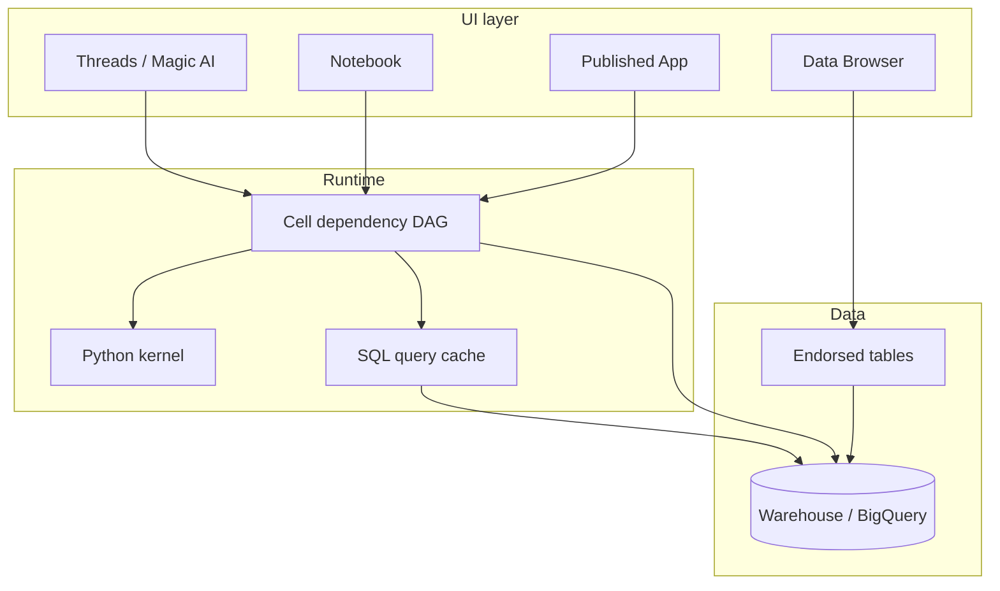

### Agent / Threads flow

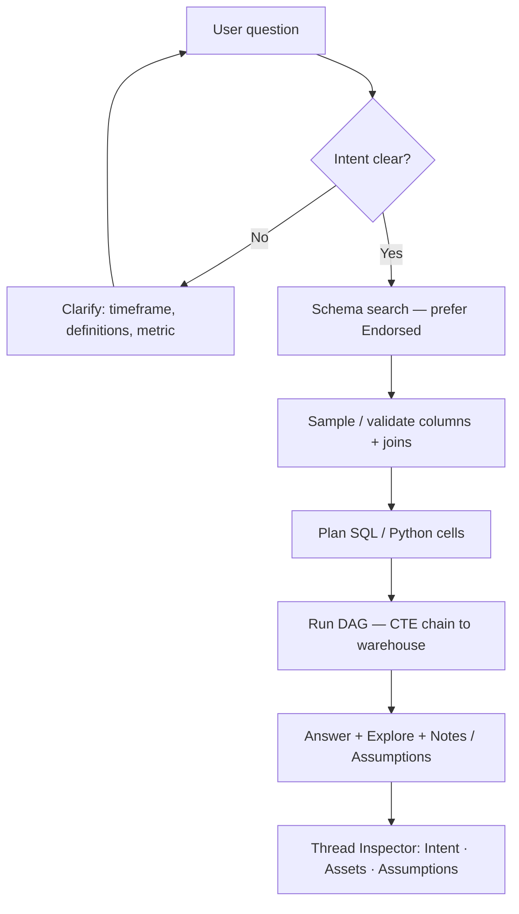

### Building blocks

| Piece | Role |
|--------|------|
| **SQL cells** | Query warehouse; Query mode keeps heavy work in BQ |
| **Cell DAG** | Downstream cells reference upstream by name |
| **Chained SQL** | Hex compiles cell chain into CTEs → one warehouse query |
| **Python / charts** | Transform and visualize in project kernel |
| **Endorsed tables** | Governance bias for AI |
| **Magic / Threads** | Agent: clarify → discover → validate → answer |
| **Notes / Assumptions** | Self-document definitions (e.g. MAU ≥ 6h) |
| **Thread Inspector** | Visible lineage of intent, assets, assumptions |
| **Query cache** | Reuse identical SQL (~60 min) |

### Example — MAU retention notebook (cell DAG)

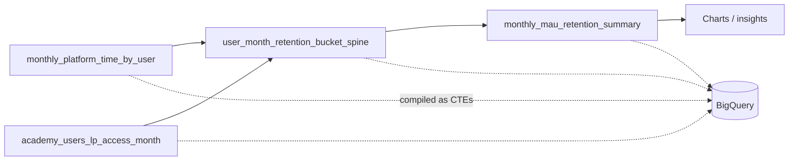

1. `monthly_platform_time_by_user` — engagement → monthly minutes / `is_active`
2. `academy_users_lp_access_month` — master LP access month
3. `user_month_retention_bucket_spine` — NEW / RETAINED / … buckets
4. `monthly_mau_retention_summary` — aggregates
5. Charts / insights on top

Each step is a **cell**; later cells reference earlier ones. That is the Hex unit of work.

---

## 2. NexA process (today)

NexA is a **Hex-inspired Ask app**: natural language → correct table → SQL → answer. Most turns are still **one Ask → one SQL** (optional short notebook chain).

### Ask pipeline

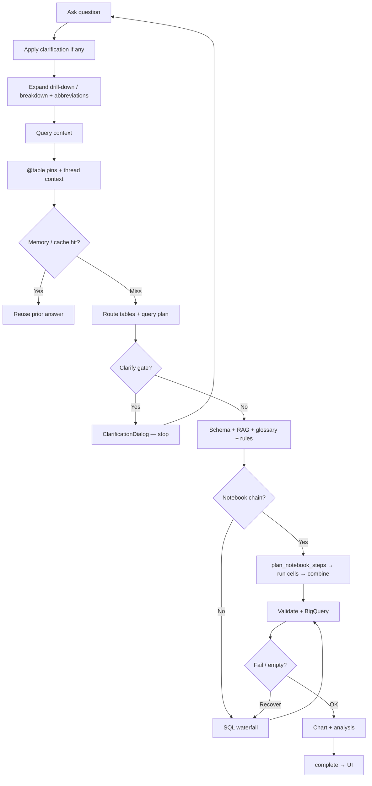

### SQL waterfall (when not a notebook chain)

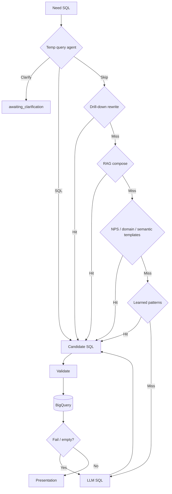

1. **Temp query agent** — plan metric / date / breakdown; clarify if unsure  
2. **Drill-down rewrite** — prior `COUNT` → `user_id` list  
3. **RAG compose** — glossary + retrieval  
4. **NPS / domain / semantic templates** — known metrics  
5. **Learned patterns** — promoted templates  
6. **LLM SQL** — last resort  
7. **Validate → BQ → recover** on failure / empty  

### Capability map

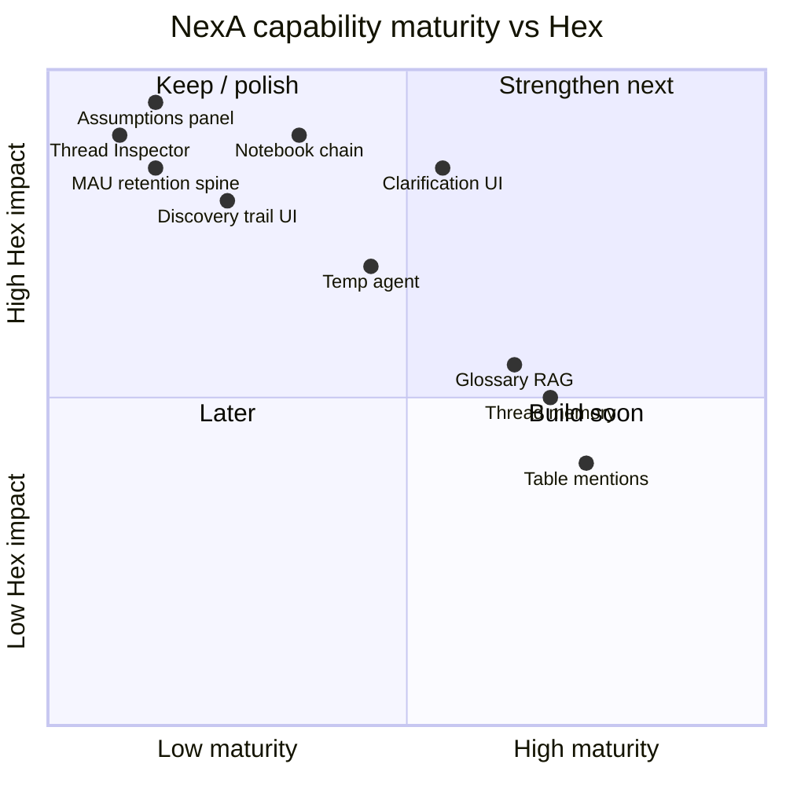

### What NexA already has

| Capability | Status |
|------------|--------|
| BigQuery + endorsed-style routing | Partial |
| Clarification UI | Partial (not always before SQL) |
| Glossary / term resolver | Yes |
| Notebook step planner + SQL chain | Early |
| Temp query agent | Yes (stopgap) |
| Thread memory / cache | Yes |
| `@table` mentions | Yes |
| Notes / Assumptions panel | No |
| Thread Inspector | No |
| Full MAU retention spine (PM Hex export) | No |
| Always-clarify-before-guess | No |
| Visible discovery trail | Weak (status + SQL tab only) |

---

## 3. Side-by-side

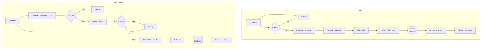

| Dimension | Hex | NexA today |
|-----------|-----|------------|
| Unit of work | Multi-cell DAG | One Ask → one SQL (+ optional chain) |
| Ambiguity | Clarify first | Clarify gate + agent; still guesses sometimes |
| Definitions | Project cells + endorsed apps | Glossary, YAML rules, templates |
| Lineage | Thread Inspector | Routing reason + SQL tab |
| Heavy logic | Chained CTEs in warehouse | Single query or short chain |
| Answer shape | Headline + Explore + Notes | Analysis + chart + SQL |
| Governance | Endorsed tables in Data Browser | Included / endorsed flags in project |

**One line:** Hex plans **cells and assumptions**; NexA mostly plans **one SQL path**.

---

## 4. What to do next (become more like Hex)

Ordered by impact. Do these in sequence; each unlocks the next.

### Roadmap overview

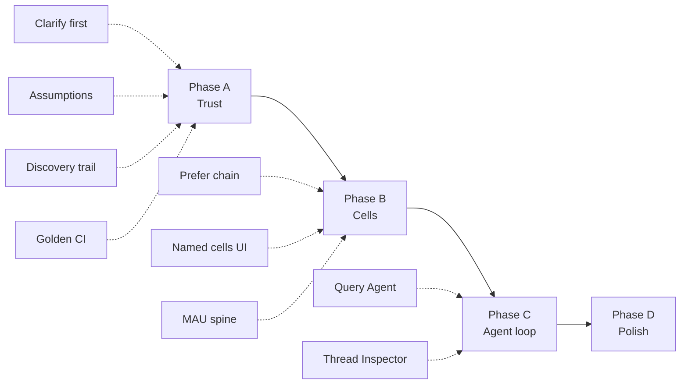

### Target state (after roadmap)

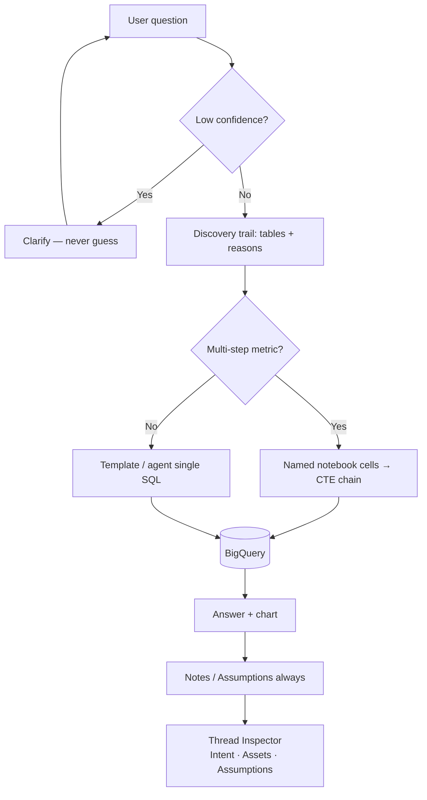

### Phase A — Stop wrong answers (trust)

| # | Work | Why (Hex behavior) | Where |
|---|------|--------------------|--------|
| A1 | **Always clarify when confidence is low** — expand `should_clarify_before_sql` + temp agent; never emit SQL on ambiguous metric/date/table | Clarify before run | `ask_clarify.py`, `temp_query_agent.py` |
| A2 | **Notes / Assumptions block** on every answer (date range, metric definition, table chosen, filters) | Notes / Assumptions | Backend complete payload + `AskSection` / InsightCard |
| A3 | **Discovery trail in UI** — tables considered, why chosen, columns matched | Visible discovery | Stream events already exist; surface in Thread panel |
| A4 | **Golden questions CI** — portal, NPS monthly, attendance ranges, drill-down, last calendar month | Regression like Hex apps | `tests/golden_questions.yaml` |

**Done when:** Ambiguous questions ask first; every answer shows assumptions; golden suite stays green.

### Phase B — Cell-first answers (Hex notebook shape)

| # | Work | Why | Where |
|---|------|-----|--------|
| B1 | **Prefer notebook chain** for multi-step metrics (retention, cohort, join+aggregate) | Cell DAG | `notebook_planner.py`, `sql_chain.py` |
| B2 | **Named cells in UI** (Hex-style labels, not only raw SQL steps) | Readable lineage | `SqlNotebookCells.jsx` |
| B3 | **CTE combine + Query-mode mindset** — keep heavy logic in BQ; preview rows in UI | Warehouse pushdown | `sql_chain.combine_sql` |
| B4 | **Port PM MAU retention spine** as endorsed notebook template (cells 1–4 from Hex export) | Match Hex report | New template under domain / notebook steps |

**Done when:** Retention / MAU-style questions produce 3–5 named cells, not one opaque SQL blob.

### Phase C — Agent loop (Hex Threads)

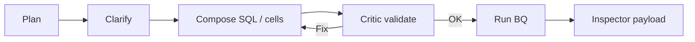

| # | Work | Why | Where |
|---|------|-----|--------|
| C1 | **Promote temp agent → real Query Agent** — plan → clarify → compose → critic → run | Magic / Threads loop | `agents/` |
| C2 | **Schema explorer sampling** before join-heavy SQL | Validate like Hex | `agents/schema_explorer.py` |
| C3 | **Query critic always on** for non-template SQL | Catch wrong measure / date | `agents/query_critic.py` |
| C4 | **Thread Inspector panel** — Intent, Assets (tables/SQL cells), Assumptions | Hex Inspector | New frontend panel |

**Done when:** Complex asks show Intent → Assets → Assumptions; critic blocks bad SQL.

### Phase D — Product polish (Hex workspace feel)

| # | Work | Why | Where |
|---|------|-----|--------|
| D1 | Endorsed-only default for AI routing | Governance | `table_routing`, Data tab |
| D2 | Stronger follow-up context (never drop prior table/filters) | Thread continuity | `ask_context`, `question_intent` |
| D3 | Knowledge answers for abbreviations without SQL | Hex can answer without querying | `knowledge_query` path |
| D4 | Optional web / doc search for definitions outside warehouse | Hex Auto + web | Later / optional |

---

## 5. Recommended next 2 weeks

Focus on **Phase A + B4 start** — highest user pain.

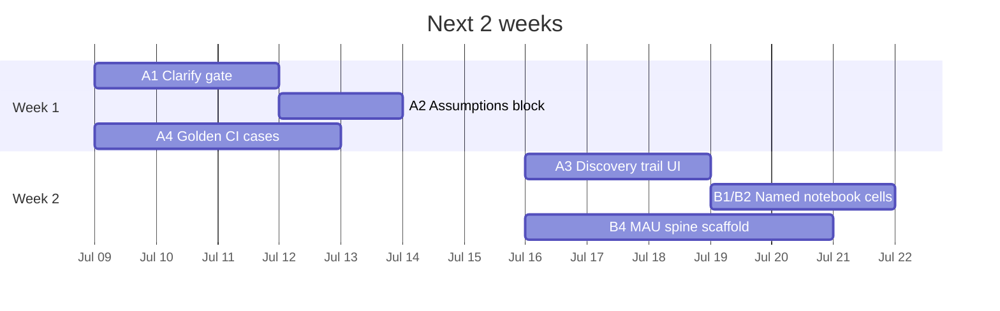

1. **Week 1**
   - A1: Tighten clarify gate (portal vs events, NPS score vs responders, date ambiguity)
   - A2: Ship Assumptions block on every `complete` response
   - A4: Add failing golden cases from recent bugs

2. **Week 2**
   - A3: Discovery trail UI (tables + reason)
   - B1/B2: Named notebook cells for join + aggregate questions
   - B4: Scaffold MAU retention cells from Hex export (even if charts come later)

Skip Phase D until A/B feel trustworthy.

---

## 6. Success criteria (Hex-like enough)

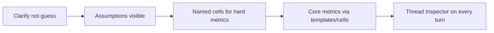

NexA is “like Hex” for NxtWave when:

1. Unclear questions **ask** instead of guessing  
2. Answers show **what was assumed** (dates, metric, table)  
3. Multi-step metrics run as **named SQL cells** chained in BQ  
4. Core academy questions (attendance, NPS, portal, placements, MAU retention) hit **templates / cells**, not free-form LLM  
5. Users can open **Intent · Assets · Assumptions** for any Thread turn  

---

## 7. Quick reference — key files

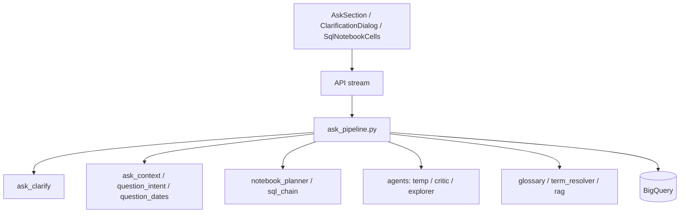

| Area | Files |
|------|--------|
| Ask pipeline | `backend/ask_pipeline.py` |
| Clarify | `backend/ask_clarify.py` |
| Dates / intent | `backend/question_dates.py`, `question_intent.py` |
| Notebook cells | `backend/notebook_planner.py`, `sql_chain.py`, `notebook_step_sql.py` |
| Agents | `backend/agents/temp_query_agent.py`, `pipeline_bridge.py`, `query_critic.py` |
| Glossary / RAG | `backend/glossary.yaml`, `rag_pipeline.py`, `term_resolver.py` |
| Frontend Ask | `frontend/src/components/AskSection.jsx`, `ClarificationDialog.jsx`, `SqlNotebookCells.jsx` |

---

## 8. Mental model

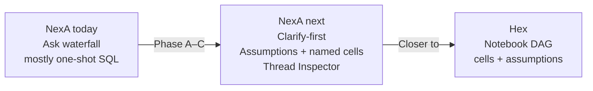

| | |
|--|--|
| **Hex** | Notebook DAG + agent that plans **cells** and documents **assumptions** |
| **NexA today** | Ask waterfall that aims at Hex answers, mostly **one-shot SQL** |
| **NexA next** | Clarify-first → Assumptions always → Named cells for hard metrics → Thread Inspector |

---

*Last updated: July 2026 — living doc; update as phases ship.*
